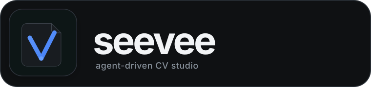

  

  
  
  
  
  
  

# Seevee

Seevee is a local, agent-driven CV studio.

Give an agent source material, let it normalize your information into structured JSON, and render that information through interchangeable Astro templates. The fixed Seevee dashboard gives you physical-page preview, comments, provenance, history, diagnostics, and PDF export without dictating what your CV has to look like.

> **Project status:** the repository currently contains the architecture, schemas, installer contract, agent skill, research, and UX specification. The production runtime/release bundles are not implemented yet.

## The idea

~~~mermaid
flowchart LR
    A[Sources PDF · DOCX · text · URLs] --> B[Agent]
    B --> C[CV JSON cvs/backend.json]
    B --> D[Provenance]
    C --> E[Presentation]
    F[Astro template] --> E
    E --> G[Seevee dashboard]
    G --> H[Comments JSON]
    H --> B
    G --> I[PDF export]
~~~

The important boundary is simple:

- **CV JSON is content.**
- **Template source is design.**
- **Presentation JSON binds a CV to a template.**
- **Comments and provenance point back to stable semantic IDs.**

A CV never owns its Astro/CSS. A template never owns the facts.

## Installation model

The intended installation path is GitHub, not npm:

~~~sh
curl -fsSL https://raw.githubusercontent.com/DrB0rk/seevee/main/install.sh | sh
~~~

Then create/open a workspace:

~~~sh
mkdir my-cv
cd my-cv
seevee init
~~~

<code>seevee init</code> is non-interactive. It will scaffold the directory, start the local dashboard server in the background, health-check it, open the browser, and return terminal control. You can then open **any agent you want** in the same directory.

The installer script is already defined in this repository, but it will only become usable once matching GitHub Release runtime bundles are published.

## Workspace model

~~~text
my-cv/
├── seevee.json
├── AGENTS.md
├── cvs/
│   ├── master.json
│   ├── backend.json
│   └── security.json
├── presentations/
│   ├── backend-minimal.json
│   └── security-custom.json
├── provenance/
├── comments/
├── sources/
├── templates/
│   └── local/
├── exports/
└── .seevee/
~~~

Every CV is a separate, complete JSON document. This makes it natural to maintain a master CV and multiple tailored variants while keeping templates independently reusable.

## CV design is not locked down

Seevee has a fixed **dashboard**, not a fixed **CV design system**.

A template can be:

- a restrained one-column resume;
- a two-column technical CV;
- a highly visual portfolio;
- a long academic CV;
- a compact ATS-oriented variant;
- a custom page size;
- a composition designed around one exact person's content;
- any other Astro/CSS layout the user and their agent intentionally create.

Templates may expose convenient controls to the dashboard, but they do not have to. A bespoke template can keep all styling in source and be edited entirely by your agent.

A4 portrait at 210 × 297 mm is only the default new-presentation profile.

## Dashboard

The dashboard itself is intentionally consistent: a dark technical workstation around bright physical pages.

~~~text
┌─────────────────────────────────────────────────────────────────────┐
│ workspace · active CV · template · page count · comments · export │
├──────┬──────────────────┬───────────────────────┬───────────────────┤
│ rail │ CVs / Sources    │                       │ Properties        │
│      │ Templates        │     physical CV       │ Comments          │
│      │ History          │       pages           │ Diagnostics       │
│      │ Agent runs       │                       │                   │
├──────┴──────────────────┴───────────────────────┴───────────────────┤
│ path · schema · render status · watcher · diagnostics              │
└─────────────────────────────────────────────────────────────────────┘
~~~

The dashboard implementation specification is maintained under [`.dev/specs/DASHBOARD_VISUAL_DESIGN.md`](.dev/specs/DASHBOARD_VISUAL_DESIGN.md).

## Agent-driven workflow

1. Put source material in the workspace.
2. The agent extracts facts and keeps provenance.
3. Create or tailor one or more independent CV JSON files.
4. Select, generate, or fork an Astro template.
5. Bind a CV and template in a presentation.
6. Seevee renders exact physical pages.
7. Add comments directly to semantic content or visual regions.
8. The agent reads the comments JSON and applies focused changes.
9. Re-render, verify, and export PDF.

Seevee does not launch or require Claude Code, Codex, OMP, Cursor, or another specific runtime. The directory is the interface.

## Schema-first core

The schema layer is the core API of the project.

~~~text
schemas/v1/
├── common.schema.json
├── cv.schema.json
├── source.schema.json
├── provenance.schema.json
├── presentation.schema.json
├── comments.schema.json
├── workspace.schema.json
├── change-set.schema.json
├── template-manifest.schema.json
├── style-preset.schema.json
├── agent-run.schema.json
└── render-diagnostics.schema.json
~~~

Stable IDs link CV nodes, provenance, comments, rendered bindings, and agent change sets. Array positions are never long-lived identity.

The current bootstrap contracts use JSON Schema Draft 2020-12. The implementation plan calls for Zod to become the runtime source of truth with generated JSON Schema artifacts checked in CI.

## Comments that survive edits

A comment can keep several selectors for the same target:

~~~text
FieldSelector / NodeSelector
        ↓
SectionSelector
        ↓
RenderBindingSelector
        ↓
TextQuoteSelector
        ↓
PageRegionSelector
~~~

A comment therefore does not become useless just because a bullet moved to another position or page.

## Agent guidance

The repository includes a reusable Seevee skill:

~~~text
skills/seevee-workspace-agent/
├── SKILL.md
├── agents/openai.yaml
└── references/
    ├── data-contract.md
    ├── comments.md
    ├── templates-and-rendering.md
    ├── cli-and-workspace.md
    ├── workflows.md
    └── cv-guidance.md
~~~

The CV guidance is deliberately **agent-facing**. It contains recent research on software engineering, frontend, backend, DevOps/SRE, security, AI/data, embedded, mobile, academic CVs, Netherlands/EU conventions, USAJOBS, and other sectors.

It is advice for drafting and review—not a hidden user-facing score, selector, or hard layout rule.

## Project documentation

| Path | Purpose |
|---|---|
| [schemas/README.md](schemas/README.md) | Machine-readable workspace/schema contracts |
| [docs/workspace-agent/README.md](docs/workspace-agent/README.md) | User workspace-agent boundary and usage |
| [docs/workspace-agent/CV_GUIDANCE.md](docs/workspace-agent/CV_GUIDANCE.md) | Long-form CV/resume research for workspace agents |
| [skills/seevee-workspace-agent/](skills/seevee-workspace-agent/) | Distributable skill used by agents creating/editing CVs |
| [examples/linked-workspace/](examples/linked-workspace/) | Linked multi-CV workspace example |

Repository-maintainer specifications, contribution rules, audits, implementation status, versioning, and release procedures are deliberately isolated under [`.dev/`](.dev/README.md).

## Design principles

**Local first.** Your workspace is a directory of readable files.

**Agent agnostic.** Use whichever coding/AI agent fits your workflow.

**Facts and design are separate.** A visual redesign should not mutate factual CV content.

**Many CVs, many templates.** Tailored CVs are first-class resources, not hidden state.

**No fake resume score.** Advice should be explainable and sourced.

**No invented achievements.** Agents must preserve provenance and never fabricate metrics.

**Design freedom.** Seevee validates that a document is safe and renderable, not whether it matches a house style.

## Research baseline

The agent guidance is grounded in current primary material from MIT, UC Berkeley, Harvard, EURES/Europass, USAJOBS, NIH, and related sources. Rules that are genuinely time-sensitive or form-specific must be rechecked at task time.

See [docs/workspace-agent/CV_GUIDANCE.md](docs/workspace-agent/CV_GUIDANCE.md).

---

Seevee is currently at **0.1.0-alpha.0** and remains in the architecture/bootstrap phase. See [`.dev/IMPLEMENTATION_STATUS.md`](.dev/IMPLEMENTATION_STATUS.md) for the exact implemented-versus-specified status.
