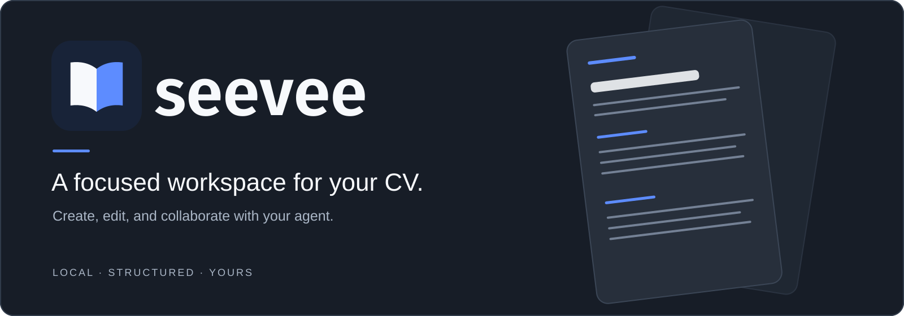

# Seevee brand pack

The source assets are SVG. PNG exports are provided for services that do not accept SVG. The mark depicts two open pages meeting at a V-shaped spine; the wordmark is lowercase Fira Sans converted to vector outlines.

## Pick an asset

| Use | Asset |
| --- | --- |
| App icon, avatar, favicon | [`mark.svg`](mark.svg), [`mark.png`](mark.png) (512 × 512) |
| Single-color icon on light or dark | [`mark-mono-dark.svg`](mark-mono-dark.svg), [`mark-mono-light.svg`](mark-mono-light.svg) |
| Logo on dark surfaces | [`wordmark-dark.svg`](wordmark-dark.svg), [`wordmark-dark.png`](wordmark-dark.png) |
| Logo on light surfaces | [`wordmark-light.svg`](wordmark-light.svg), [`wordmark-light.png`](wordmark-light.png) |
| Single-color wordmark | [`wordmark-mono-dark.svg`](wordmark-mono-dark.svg), [`wordmark-mono-light.svg`](wordmark-mono-light.svg) |
| Wide header or README hero | [`banner-dark.svg`](banner-dark.svg), [`banner-light.svg`](banner-light.svg); 1600 × 560 PNG exports are alongside them |
| Social or repository preview | [`social-dark.png`](social-dark.png), [`social-light.png`](social-light.png) (1200 × 630); SVG sources are alongside them |

The Studio serves the same mark at `/seevee-logo.svg`, a 32 × 32 PNG favicon, and a 180 × 180 Apple touch icon. Its `/seevee-social.png` is a copy of the dark social card.

## Usage

- Prefer SVG when the destination supports it. Use the matching light or dark variant for the background; the icon tile works on either.
- Keep clear space around the icon equal to at least one quarter of its width. Keep at least the icon's height of space around a full wordmark or banner.
- Use the standalone mark at 24 px or larger. Use the wordmark when there is room for both icon and name; avoid shrinking the full lockup below 180 px wide.
- Preserve the asset's aspect ratio and colors. Do not place copy or controls over the mark.
- For a monochrome print or engraving, use the single-color versions on a contrasting surface.

Core colors: navy `#182338`, blue `#5D8CFF`, off-white `#F7F9FC`, ink `#172133`. The banner art uses flat neutral surfaces and a restrained page illustration. It is brand artwork, not a CV template.

## Regenerate

`build.py` recreates the SVGs and PNG exports from the shared mark geometry. It requires Python `fonttools`, Fira Sans SemiBold, `fc-match`, and `rsvg-convert`. Set `SEEVEE_BRAND_FONT` to a Fira Sans SemiBold `.ttf` path if `fc-match` is unavailable. The generated files are committed, so using the pack requires none of these tools.
